# pixel_character_generator
 Generating retro pixel game characters with Generative Adversarial Networks. Dataset "TinyHero" included.
 
 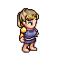    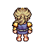  
 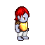      
 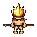  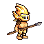    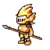

 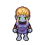  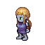  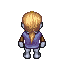  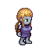
 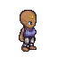  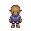  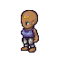  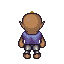
 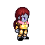  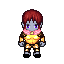  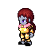  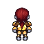

 
 # Dataset TinyHero
 
 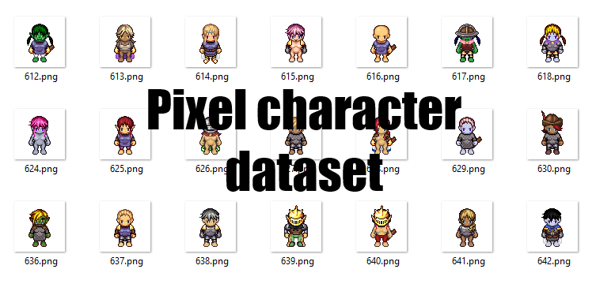
 
Dataset TinyHero includes 64x64 retro-pixel character. All characters were generated with [Universal LPC spritesheet by makrohn](https://github.com/makrohn/Universal-LPC-spritesheet/tree/7040e2fe85d2cb1e8154ec5fce382589d369bdb8). Each character in the dataset was randomly generated including: sex, body type, skin color and equipment with LPC spritesheet with 4 different angles view. 

| Image sixe | Dataset size  | Source          | Download |
|------------|---------------|-----------------|----------|
| 64x64      | 3648 images   | [LPC Spritesheet](https://github.com/makrohn/Universal-LPC-spritesheet/tree/7040e2fe85d2cb1e8154ec5fce382589d369bdb8) | [data.zip](data.zip)|
|            | 912 per class |                 |          |

According to the rules of the LPC all art submissions were dual licensed under both GNU GPL 3.0 and CC-BY-SA 3.0. Further work produced in this repository is licensed under the same terms.

CC-BY-SA 3.0:
http://creativecommons.org/licenses/by-sa/3.0/
See the file: cc-by-sa-3.0.txt

GNU GPL 3.0:
http://www.gnu.org/licenses/gpl-3.0.html
See the file: gpl-3.0.txt

 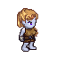  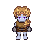  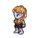  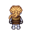
 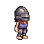  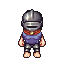  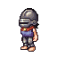  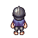
 
# Pixel Character Generator - DCGAN
Based on the DCGAN pytorch tutorial: https://pytorch.org/tutorials/beginner/dcgan_faces_tutorial.html

  * Experimented with latent size (input for Generator) and feature map sizes 
  * Added soft and noisy labels
  * Added Wasserstein loss which is a good solution for mode collapse
    * Wasserstein loss - https://developers.google.com/machine-learning/gan/loss
    * mode collapse - https://machinelearningmastery.com/practical-guide-to-gan-failure-modes/
  * Added dropout in both generator and discriminator

* [DCGAN Tutorial](https://pytorch.org/tutorials/beginner/dcgan_faces_tutorial.html)
* [Final notebook with modified DCGAN](https://github.com/AgaMiko/pixel_character_generator/blob/master/notebooks/3_DCGAN.ipynb)

### Example results

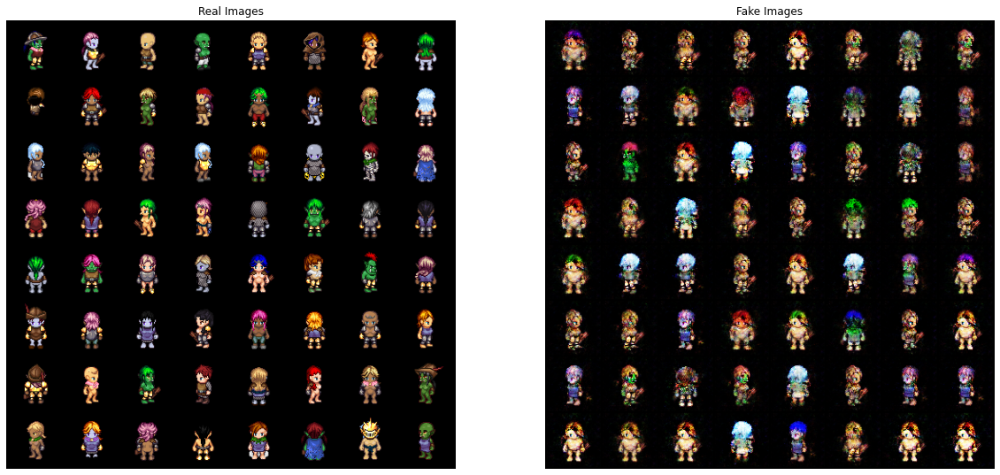

# Conditional DCGAN

Conditional DCGAN that generates a pixel character seen from selected angle.

* different learning rate for discriminator and generator
* soft labels
* added classification loss to the discriminator. Discriminator have to guess fake/real but also the character angle
* generator is conditioned with embedding from trainable look-up table that gives the info about the character view angle

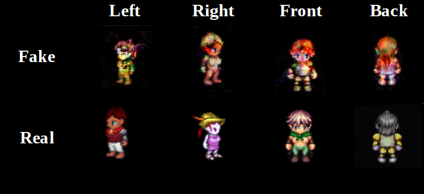

* [notebook with modified Conditional DCGAN](https://github.com/AgaMiko/pixel_character_generator/blob/master/notebooks/4_Conditional_DCGAN.ipynb)

# DC Autoencoder
Deep convolutional autoencoder. This autoencoder have the same architecture as DCGAN above. The only difference is the additional fully-connected layer at the top of the encoder, which projects output from convolutional layer to selected latent size.

* embedding size = 40 is enough for a good-quality reconstruction
* autoencoder have great denoising properties
* easier and more stable to train then GAN's

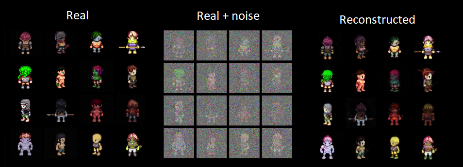

* [notebook with Deep Convolutional Autoencoder](notebooks/5_DC_Autoencoder.ipynb)

