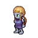
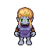
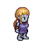
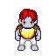
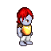
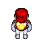
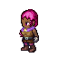
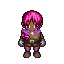
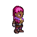
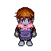

# pixel_character_generator
 Generating retro pixel game characters with Generative Adversarial Networks. Dataset included.
 
       
       
       
       
       
       

 
 # Dataset
 Dataset includes 64x64 retro-pixel character. Each character was randomly generated including: sex, body type, skin color and equipment. Each character is viewed from 4 different angles. All characters were generated with [Universal LPC spritesheet by makrohn](https://github.com/makrohn/Universal-LPC-spritesheet/tree/7040e2fe85d2cb1e8154ec5fce382589d369bdb8)
 
 According to the rules of the LPC all art submissions were dual licensed under both GNU GPL 3.0 and CC-BY-SA 3.0. Further work produced in this repository is licensed under the same terms.

CC-BY-SA 3.0:
http://creativecommons.org/licenses/by-sa/3.0/
See the file: cc-by-sa-3.0.txt

GNU GPL 3.0:
http://www.gnu.org/licenses/gpl-3.0.html
See the file: gpl-3.0.txt

       
